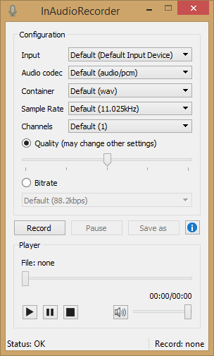

# InAudioRecorder

InAudioRecorder is a simple program written in C++ with Qt framework. It records audio from selected input device saving it to file.

# Features
- record from any input device avaible in OS
- set audio format and record configuration
- play recorded audio
- save record file in selected location

# Releases
[Windows x64](https://github.com/artud54/InAudioRecorder/releases, "Windows x64")

# About Project
Solution was created with Visual Studio 2017 with Qt 5.9. Files: .pro and .pri were automatically generated by Qt Visual studio add-on. C++11 is required.

